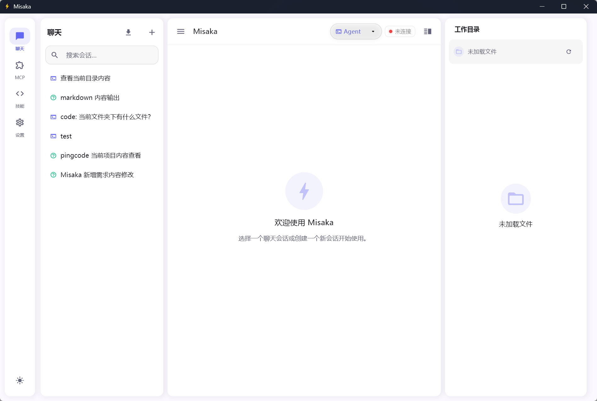
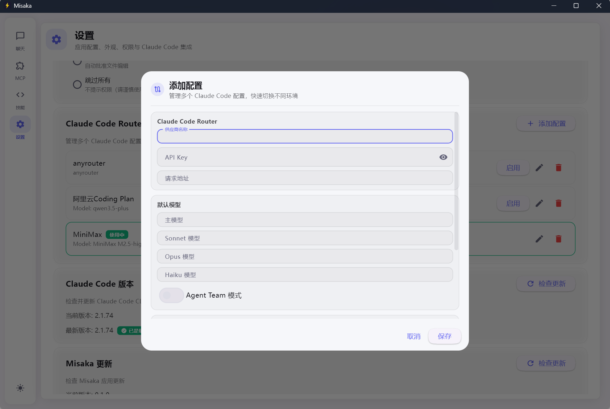
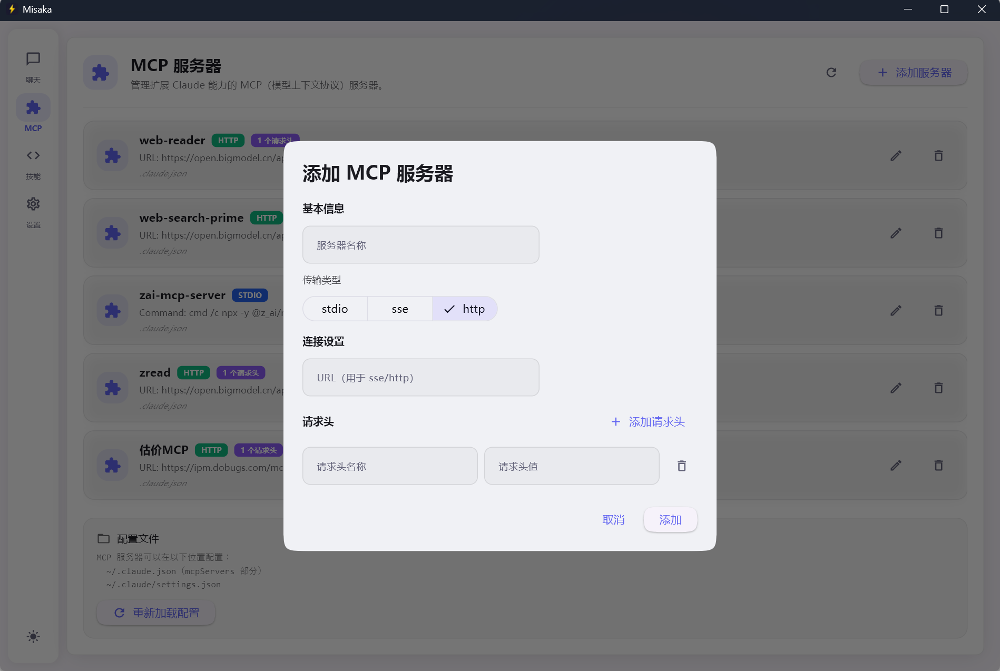
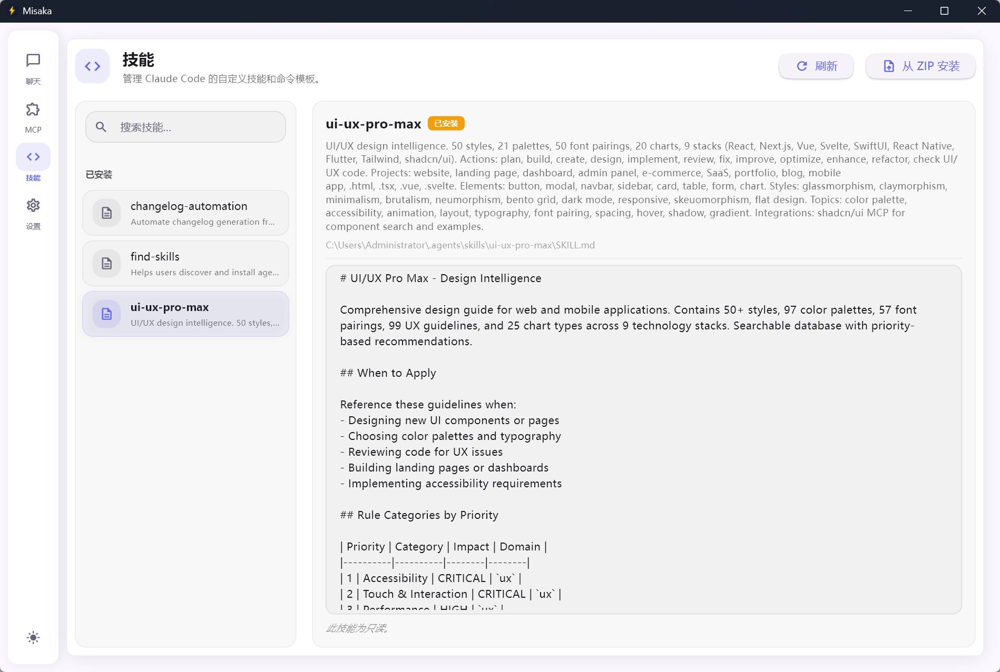

# Misaka

[](LICENSE)
[](https://www.python.org/)
[](https://flet.dev)
[](https://github.com/knqiufan/Misaka)

中文 · [English](README_EN.md)

**当前项目完全开源，只用作学习使用，项目还比较初级有很多地方需要持续优化，欢迎大家来 star 一同共建~**

> 基于 Python 和 [Flet](https://flet.dev) 构建的 Claude Code 桌面 GUI 客户端。

Misaka 将 Claude Code 的强大能力带入精致的原生桌面体验——多轮流式对话、会话管理、文件树浏览、MCP 服务器集成等功能，全部融入简洁的 Material Design 3 界面。



---

## 关于名称

Misaka（御坂），致敬《某科学的超电磁炮》，寓意像御坂网络一样拥有强大的计算和连接能力。这个名字我很喜欢！

---

## 🌟 为什么选择 Misaka？

Misaka 具有以下**独有特性**：

| 特性 | 说明 |
|------|------|
| **🔍 环境检查** | 启动时自动检测 Claude Code CLI、Node.js、Python、Git 是否已安装。缺失时提供一键安装，使用平台专属命令（winget/brew/apt）。 |
| **📦 版本检查** | 启动时自动检测 Claude Code CLI 是否有新版本，支持一键升级（`npm install -g @anthropic-ai/claude-code@latest`）。 |
| **🔀 Claude Code Router** | 管理多套 API 配置（不同提供商、模型、Agent Team 模式），一键切换并写入 `~/.claude/settings.json`。目前其他 GUI 均无此功能。 |
| **🖥️ 原生桌面** | 基于 Python + Flet（Flutter），非 Web 应用，以原生窗口运行。 |
| **🛡️ 权限控制** | 细粒度工具权限模式，在文件编辑或执行 shell 命令前弹出交互式审批对话框。 |
| **📚 技能管理** | 在应用内查看、从 ZIP 安装和刷新 Claude Code Skills（扩展）。 |

---

## ✨ 功能特性

| 分类 | 详情 |
|---|---|
| **多模型对话** | 通过 `/model` 命令在 Claude Sonnet、Opus、Haiku 之间自由切换 |
| **流式响应** | 实时逐 token 渲染，支持随时中止，内置 Thinking 动画，中断后显示错误提示 |
| **会话管理** | 创建、重命名、删除、搜索对话会话 |
| **三种对话模式** | `Code`（编码）· `Plan`（规划）· `Ask`（问答）——下拉选择器 |
| **快捷命令发送** | `/init` 等命令可直接发送，无需先打开命令框 |
| **文件树浏览器** | 在右侧面板浏览项目目录，支持文件实时预览 |
| **MCP 服务器支持** | 从 Claude 配置文件加载并管理 Model Context Protocol 服务器，支持删除确认、刷新及 HTTP 请求头配置 |
| **技能管理** | 在「技能」页面查看、从 ZIP 安装和刷新 Claude Code Skills |
| **Claude Code Router** | 多配置系统，管理不同的 API 提供商和模型预设 |
| **导入 CLI 会话** | 将 Claude Code CLI 的历史会话导入到 Misaka，支持分页加载与搜索 |
| **多语言界面** | English · 简体中文 · 繁體中文 |
| **主题切换** | 浅色 / 深色 / 跟随系统——重启后自动恢复，支持自定义强调色 |
| **API 提供商配置** | 添加并管理多个 Anthropic API 提供商，支持自定义 Base URL |
| **权限控制** | 细粒度工具权限模式，支持交互式审批对话框 |
| **更新提醒** | 启动时自动检测 Claude Code CLI 是否有新版本 |
| **跨平台** | Windows · macOS |
| **开发者模式** | 支持热重载和调试日志，便于开发调试 |

---

## 🛠 技术栈

| 分类 | 技术 |
|------|------|
| **语言** | Python 3.10+ |
| **UI 框架** | [Flet](https://flet.dev)（基于 Flutter） |
| **Claude 集成** | [claude-agent-sdk](https://pypi.org/project/claude-agent-sdk/) |
| **运行时** | Node.js（Claude Code CLI） |
| **语法高亮** | Pygments |
| **图片处理** | Pillow |
| **文件监听** | watchdog |
| **异步 I/O** | aiofiles · anyio |

---

## 📋 环境要求

- **Python** 3.10 及以上
- **Node.js**（用于 Claude Code CLI）
- **Claude Code CLI** — 通过 npm 安装：
  ```bash
  npm install -g @anthropic-ai/claude-code
  ```
- **Anthropic API Key** — 通过环境变量设置，或在应用「设置」页面中配置

---

## 🚀 快速开始

```bash
# 1. 克隆仓库
git clone https://github.com/knqiufan/Misaka.git
cd Misaka

# 2. 安装依赖
pip install -e ".[dev]"

# 3. 设置 API Key（或在「设置」页面中配置）
set ANTHROPIC_API_KEY=sk-ant-...    # Windows
export ANTHROPIC_API_KEY=sk-ant-... # macOS / Linux

# 4. 启动 Misaka
misaka
# 或
python -m misaka.main
```

应用窗口默认尺寸为 **1280 × 860**（最小 800 × 600）。所有数据——会话、设置、日志——均存储在 `~/.misaka/` 目录下。

---

## ⚙️ 配置说明

### API Key

在启动前设置环境变量，或在应用内「设置 → API 提供商」中添加：

```bash
export ANTHROPIC_API_KEY=sk-ant-...
```

### Claude Code Router — 快速指南

**Claude Code Router** 用于管理多套 API 配置，并可一键切换。



**1. 添加配置**

- 进入 **设置 → Claude Code Router**
- 点击 **添加配置**
- 填写：
  - **提供商名称** — 如「Anthropic 官方」「自定义 API」
  - **API Key** — 你的 Anthropic API 密钥
  - **请求 URL** — 默认留空，或填写自定义 Base URL
  - **主模型 / Haiku / Opus / Sonnet 模型** — 各档位模型 ID
  - **Agent Team 模式** — 是否启用 Agent Teams 功能

**2. 启用配置**

- 在目标配置上点击 **启用**
- Misaka 会将配置写入 `~/.claude/settings.json`
- Claude Code CLI 将使用该配置进行所有会话

**3. 典型场景**

- 在 Anthropic 官方 API 与第三方兼容端点之间切换
- 不同项目使用不同模型（如 Haiku 快速任务、Opus 复杂编码）
- 工作与个人 API Key 分开管理

### 第三方插件（MCP 服务器）— 快速指南

MCP（Model Context Protocol）服务器可扩展 Claude Code 能力，例如连接数据库、API、文件系统等。



**方式一：在 Misaka 界面中配置**

1. 从侧边栏打开 **插件**（MCP 服务器）
2. 点击 **添加服务器**
3. 选择 **传输类型**：
   - **stdio** — 本地进程（如 `npx -y @modelcontextprotocol/server-filesystem ~/Documents`）
   - **http** — 远程 HTTP 端点（如 `https://mcp.notion.com/mcp`）
   - **sse** — 旧版 SSE 端点
4. **stdio**：填写 **命令** 和 **参数**（空格分隔）
5. **http/sse**：填写 **URL**
6. 点击 **添加** — 配置会保存到 `~/.claude.json` 或 `~/.claude/settings.json`

**方式二：通过配置文件编辑**

编辑 `~/.claude.json` 或 `~/.claude/settings.json`：

```json
{
  "mcpServers": {
    "filesystem": {
      "command": "npx",
      "args": ["-y", "@modelcontextprotocol/server-filesystem", "/path/to/dir"]
    },
    "notion": {
      "type": "http",
      "url": "https://mcp.notion.com/mcp"
    }
  }
}
```

保存后，在插件页面点击 **重新加载配置**。更多示例见 [Claude Code MCP 文档](https://code.claude.com/docs/en/mcp)。

### Skills（技能）— 快速指南

Skills（Claude Code 扩展）是提供可复用指令与模板的 Markdown 文件。从侧边栏打开 **技能** 即可创建、编辑和管理技能。技能详情中可浏览文件夹内容，右键点击技能可在系统文件管理器中打开所在文件夹。



**技能来源**

| 来源 | 路径 |
|------|------|
| **全局** | `~/.claude/commands/*.md` — 全局可用 |
| **项目** | `./.claude/commands/*.md` — 按项目生效 |
| **已安装** | `~/.claude/skills/*/SKILL.md` 与 `~/.agents/skills/*/SKILL.md` |
| **插件** | `~/.claude/plugins/marketplaces/*/plugins/*/commands/*.md` |

**1. 查看技能**

- 从侧边栏打开 **技能**，技能按来源（全局、项目、已安装、插件）分组展示。
- 使用搜索框按名称或描述筛选。

**2. 从 ZIP 安装**

- 点击 **从 ZIP 安装** 并选择本地 `.zip` 文件
- 压缩包需包含带 `SKILL.md` 的目录，将解压到 `~/.claude/skills/<包名>/`

**3. 刷新**

- 点击 **刷新** 可在手动修改文件后重新加载所有技能。

### 数据目录

覆盖默认的 `~/.misaka/` 存储位置：

```bash
export MISAKA_DATA_DIR=/path/to/custom/dir
```

---

## 🛠 开发指南

```bash
# 安装开发依赖
pip install -e ".[dev]"

# 运行测试
pytest

# 代码检查（Ruff）
ruff check misaka/

# 类型检查（mypy）
mypy misaka/

# 运行开发模式（热重载）
python -m misaka.main
# 或使用 flet run
flet run -m misaka.main -d -r
```

### 打包为独立可执行文件

```bash
pip install -e ".[build]"
pyinstaller misaka.spec
```

打包后的可执行文件以 GUI 应用运行，不会弹出控制台窗口。在 Windows 上，子进程调用（如 Claude Code CLI）会被隐藏，避免控制台闪烁。

---

## 📦 主要依赖

| 包名 | 用途 |
|---|---|
| `flet >= 0.27` | 基于 Flutter 的跨平台 UI 框架 |
| `claude-agent-sdk >= 0.1.5` | 官方 Claude Code Agent 集成 SDK |
| `Pygments >= 2.18` | 代码块语法高亮 |
| `watchdog >= 4.0` | 文件系统事件监听 |
| `aiofiles >= 24.0` | 异步文件 I/O |
| `anyio >= 4.0` | 异步并发原语 |
| `Pillow >= 10.0` | 图片处理与预览 |

---

## 📄 许可证

[Apache License 2.0](LICENSE)
