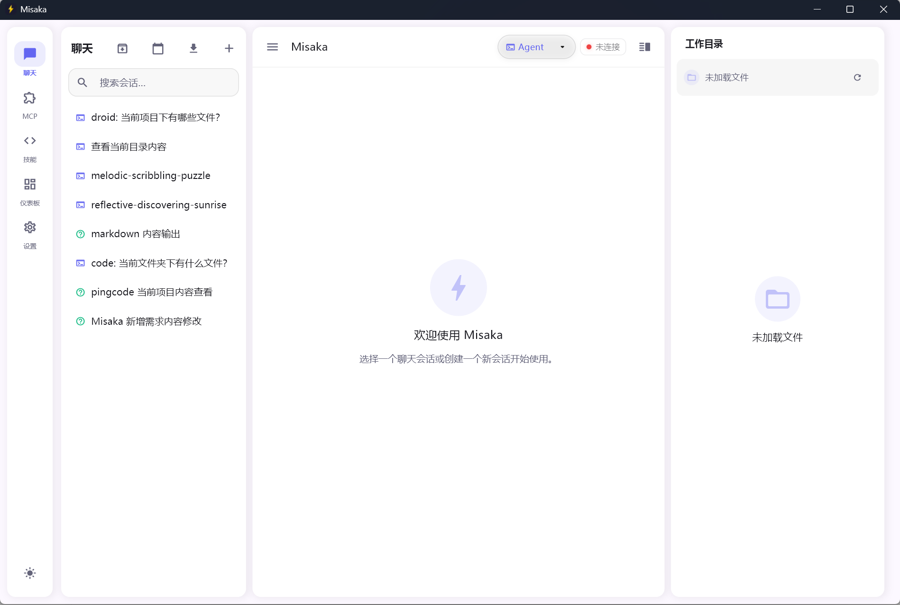
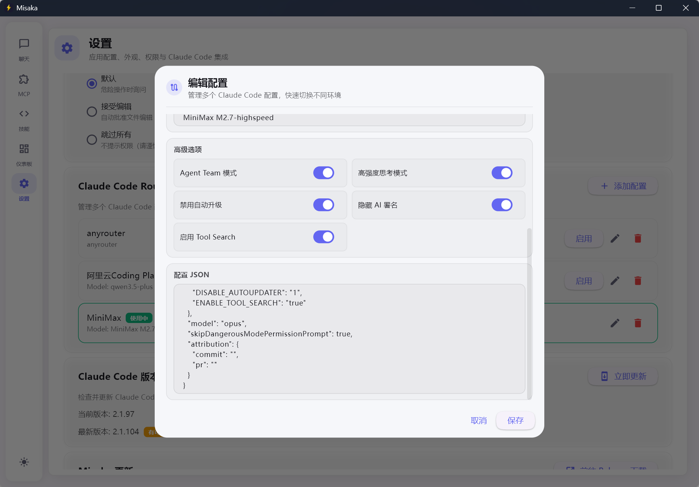
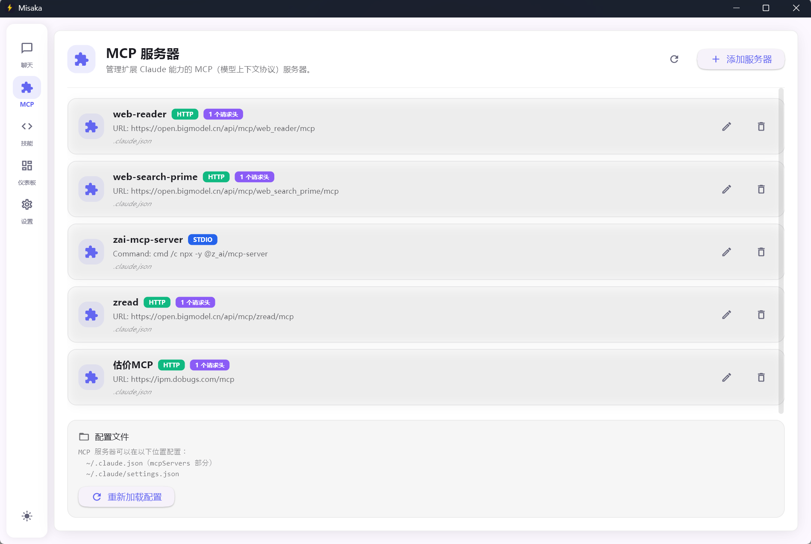
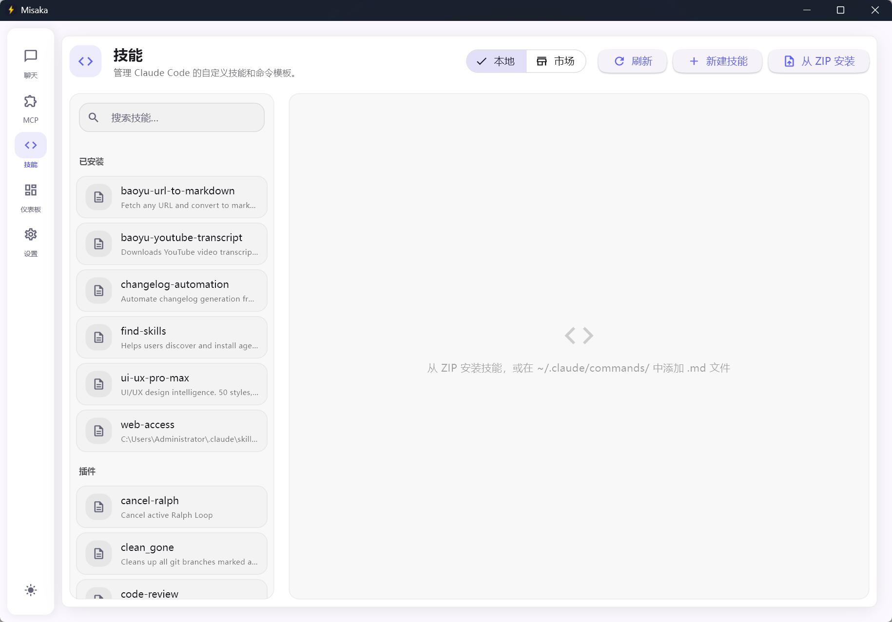
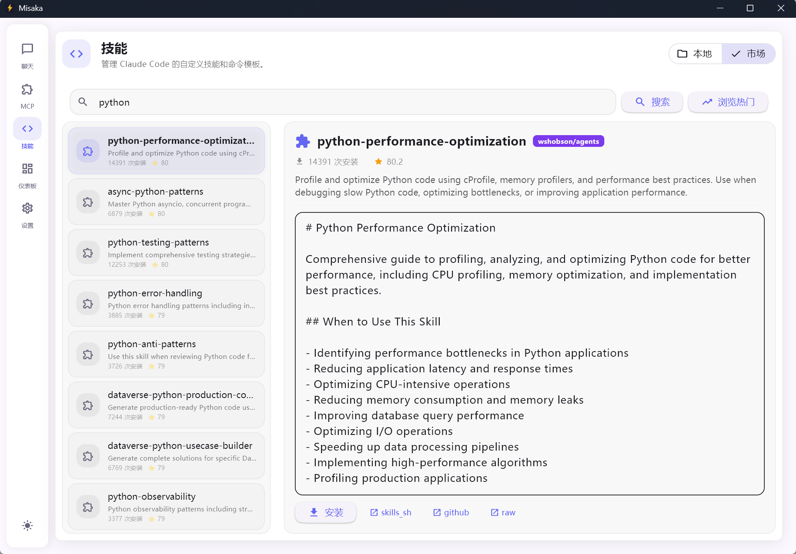
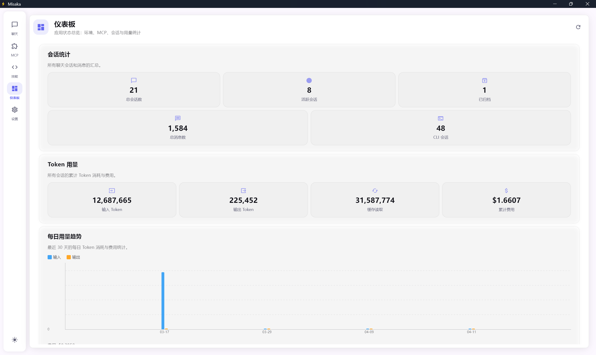

<p align="center">
  
</p>

<h1 align="center">Misaka</h1>

<p align="center">
  <strong>Claude Code 桌面 GUI 客户端</strong><br>
  用原生桌面体验释放 Claude Code 的全部潜力
</p>

<p align="center">
  <a href="https://github.com/knqiufan/Misaka/releases"></a>
  <a href="LICENSE"></a>
  <a href="https://www.python.org/"></a>
  <a href="https://flet.dev"></a>
  <a href="https://github.com/knqiufan/Misaka"></a>
</p>

<p align="center">
  中文 · <a href="README_EN.md">English</a>
</p>

---

> **完全开源，欢迎 Star 和贡献！** 项目正在快速迭代中，期待与你一起共建。

## 这是什么？

**Misaka** 是一个基于 Python + [Flet](https://flet.dev)（Flutter）构建的 **Claude Code 桌面 GUI 客户端**。它解决了 Claude Code 仅有命令行界面的痛点，将多轮流式对话、会话管理、文件浏览、MCP 服务器集成、技能市场等能力整合进一个精致的 Material Design 3 原生桌面应用中。

**一句话概括：** 让你像使用 VS Code 一样使用 Claude Code，但更轻量、更专注。



---

## 为什么选择 Misaka？

### 解决的核心问题

- **没有官方 GUI**：Claude Code 只提供 CLI，Misaka 提供完整的图形化操作界面
- **多配置切换困难**：手动编辑配置文件切换 API 提供商和模型？Misaka 的 Router 一键搞定
- **环境配置繁琐**：首次使用不知从何下手？引导式设置向导自动检测并配置一切
- **缺乏运行状态可视化**：Token 用量、MCP 服务器状态、会话统计——仪表板一目了然

### 独有亮点

| 特性 | 说明 |
|------|------|
| **Claude Code Router** | 管理多套 API 配置（不同提供商 / 模型 / Agent Team 模式），一键切换并写入 `~/.claude/settings.json`——**同类工具中独此一家** |
| **引导式设置向导** | 首次启动自动引导：CLI 检测 → API 配置 → 工作目录选择，零配置上手 |
| **Provider Doctor** | 一键诊断 CLI 安装、API Key 有效性、环境变量完整性，精确定位问题并给出修复建议 |
| **统一仪表板** | 环境状态、MCP 服务器健康、会话统计、技能概览、Token 累计用量——全局视角掌控一切 |
| **技能在线市场** | 浏览、搜索、一键安装来自 skills.sh 的社区技能扩展 |
| **Thinking 可视化** | 实时展示模型推理过程，可折叠的 Thinking Block 让你理解 AI 的思考路径 |
| **原生桌面应用** | 基于 Flutter 渲染，非 Web 应用——启动快、占用低、体验原生 |

---

## 功能全景

### 对话与交互

- **流式响应** — 实时逐 token 渲染，支持随时中止
- **三种对话模式** — `Code`（编码）· `Plan`（规划）· `Ask`（问答），一键切换
- **多模型切换** — 通过 `/model` 在 Sonnet、Opus、Haiku 之间自由切换
- **Thinking Block** — 实时展示 AI 推理过程，可折叠查看
- **快捷命令** — `/init`、`/doctor` 等斜杠命令直接发送
- **权限控制** — 文件编辑或 Shell 命令执行前弹出交互式审批对话框
- **消息复制** — 用户消息和 AI 回复均支持右键复制

### 会话管理

- **创建 / 重命名 / 删除 / 搜索** 会话
- **按项目分组** — 会话列表支持按工作目录分组或按日期分组，侧栏一键切换
- **会话归档** — 右键归档不需要的会话，随时恢复，保持列表整洁
- **导入 CLI 会话** — 将 Claude Code CLI 的历史会话一键导入，支持分页加载与搜索

### 智能诊断

- **环境检查** — 启动时自动检测 Claude Code CLI、Node.js、Python、Git，缺失时提供一键安装
- **版本检查** — 自动检测 CLI 新版本，支持一键升级
- **Provider Doctor** — 结构化诊断探针：CLI 存在性、API Key 有效性、环境变量完整性，分级报告 + 修复建议
- **结构化错误分类器** — 16 类错误自动分类（网络 / 认证 / 限流 / 解析 / 权限 / 超时等），友好的错误提示 + 建议操作

### 数据与可视化

- **统一仪表板** — 环境状态、MCP 健康、会话统计、技能统计、Token 累计概览
- **每日统计图表** — 按天聚合 Token 用量，柱状图可视化输入 / 输出 Token
- **上下文用量指示器** — 聊天底栏实时显示 Token 消耗和上下文窗口使用进度
- **运行时日志** — 内存环形缓冲（200 条），自动脱敏，设置页面可直接查看

### 扩展生态

- **MCP 服务器管理** — 支持 stdio / http / sse 三种传输类型，UI 添加或配置文件编辑
- **项目级 MCP 配置** — 自动加载项目目录下的 `.mcp.json`，按项目隔离 MCP 工具
- **技能管理** — 查看全局 / 项目 / 已安装 / 插件四类技能来源
- **技能在线市场** — 搜索并安装 skills.sh 社区技能
- **技能编辑器** — 双窗格布局：左侧 SKILL.md 编辑器 + 右侧文件夹浏览器

### 个性化

- **多语言** — English · 简体中文 · 繁體中文
- **主题切换** — 浅色 / 深色 / 跟随系统，支持自定义强调色
- **数据目录自定义** — 通过环境变量 `MISAKA_DATA_DIR` 指定存储位置

---

## 截图

<details>
<summary>点击展开更多截图</summary>

**Claude Code Router 配置管理**



**MCP 服务器管理**



**技能管理**





**仪表盘**



</details>

---

## 快速开始

### 环境要求

| 依赖 | 要求 |
|------|------|
| Python | 3.10+ |
| Node.js | 用于 Claude Code CLI |
| Claude Code CLI | `npm install -g @anthropic-ai/claude-code` |
| API Key | Anthropic API Key（环境变量或应用内配置） |

### 安装与运行

```bash
# 克隆仓库
git clone https://github.com/knqiufan/Misaka.git
cd Misaka

# 安装依赖
pip install -e ".[dev]"

# 设置 API Key（也可在应用「设置」中配置）
set ANTHROPIC_API_KEY=sk-ant-...    # Windows
export ANTHROPIC_API_KEY=sk-ant-... # macOS / Linux

# 启动
misaka
# 或
python -m misaka.main
```

应用窗口默认 **1280 × 860**（最小 800 × 600）。所有数据存储在 `~/.misaka/`。

---

## 配置指南

### Claude Code Router

管理多套 API 配置，一键切换，无需手动编辑文件。

1. 进入 **设置 → Claude Code Router** → 点击 **添加配置**
2. 填写提供商名称、API Key、Base URL、各模型 ID
3. 点击 **启用** — 配置自动写入 `~/.claude/settings.json`

**典型场景：**
- 官方 API 与第三方兼容端点之间切换
- 不同项目使用不同模型（Haiku 快速迭代、Opus 复杂编码）
- 工作与个人 API Key 分离

### MCP 服务器

**方式一：UI 配置** — 侧栏 → 插件 → 添加服务器 → 选择传输类型（stdio / http / sse）

**方式二：配置文件** — 编辑 `~/.claude.json` 或 `~/.claude/settings.json`：

```json
{
  "mcpServers": {
    "filesystem": {
      "command": "npx",
      "args": ["-y", "@modelcontextprotocol/server-filesystem", "/path/to/dir"]
    },
    "notion": {
      "type": "http",
      "url": "https://mcp.notion.com/mcp"
    }
  }
}
```

**项目级配置** — 在项目根目录放置 `.mcp.json`，Misaka 自动加载。

### 数据目录

```bash
export MISAKA_DATA_DIR=/path/to/custom/dir
```

---

## 技术栈

| 分类 | 技术 |
|------|------|
| **语言** | Python 3.10+ |
| **UI 框架** | [Flet](https://flet.dev)（基于 Flutter） |
| **Claude 集成** | [claude-agent-sdk](https://pypi.org/project/claude-agent-sdk/) |
| **图表** | flet-charts |
| **语法高亮** | Pygments |
| **图片处理** | Pillow |
| **文件监听** | watchdog |
| **异步 I/O** | aiofiles · anyio |

### 架构概览

```
用户操作 → Flet UI 层 → AppState（单一状态源） → ServiceContainer → Database / Claude SDK
```

---

## 开发

```bash
# 安装开发依赖
pip install -e ".[dev]"

# 运行测试
pytest

# 代码检查
ruff check misaka/

# 类型检查
mypy misaka/

# 热重载开发模式
flet run -m misaka.main -d -r
```

### 打包

```bash
pip install -e ".[build]"
pyinstaller misaka.spec
```

---

## 关于名称

**Misaka**（御坂）——致敬《某科学的超电磁炮》，寓意像御坂网络一样拥有强大的计算和连接能力。

---

## 贡献

欢迎提交 Issue 和 Pull Request！项目正在快速迭代中，你的参与是最大的支持。

## 许可证

[Apache License 2.0](LICENSE)
