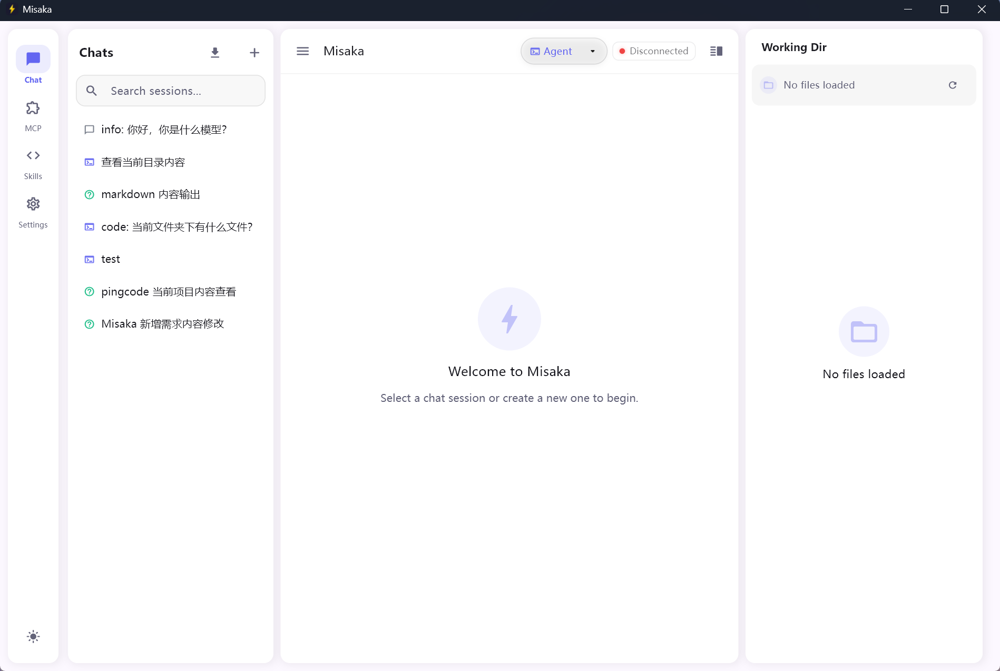
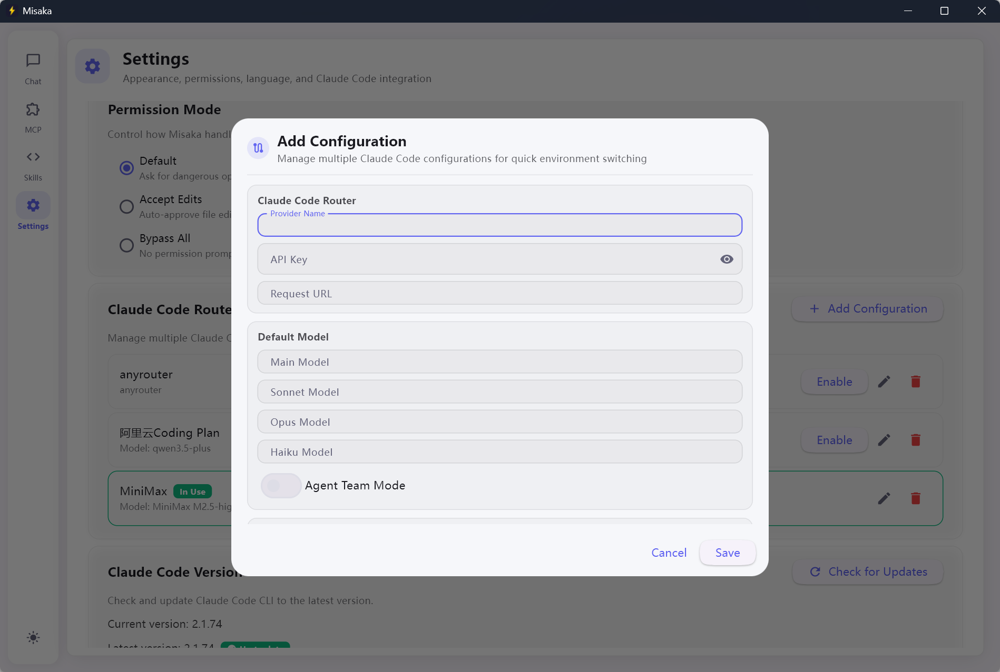
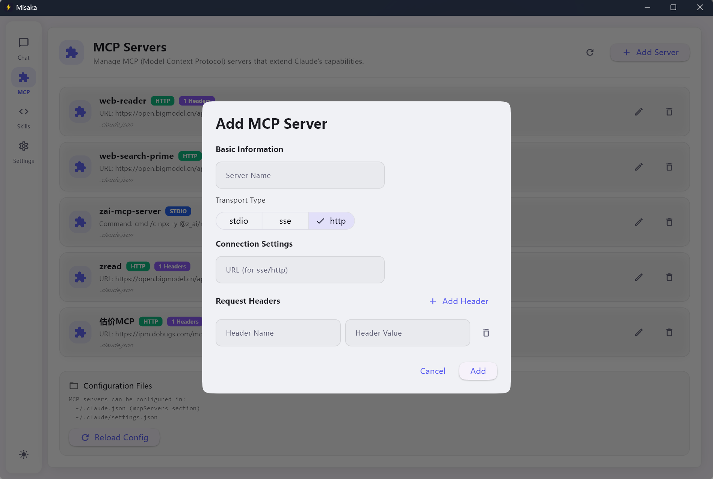
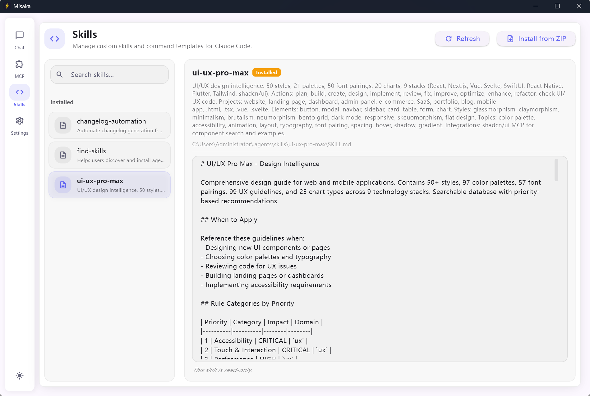

# Misaka

[](LICENSE)
[](https://www.python.org/)
[](https://flet.dev)
[](https://github.com/knqiufan/Misaka)

[中文](README.md) · English

**This project is fully open source and for learning purposes only. It is still in early stages with many areas needing continuous improvement. Welcome to star and contribute!**

> A desktop GUI client for Claude Code, built with Python and [Flet](https://flet.dev).

Misaka brings the power of Claude Code to a polished native desktop experience — multi-turn streaming conversations, session management, file tree browsing, MCP server integration, and more, all wrapped in a clean Material Design 3 interface.



---

## About the Name

Misaka (御坂) — a tribute to *A Certain Scientific Railgun* (某科学的超电磁炮). The name evokes the Misaka Network's powerful computing and connectivity. I love it!

---

## 🌟 Why Misaka?

Misaka stands out with these **unique features**:

| Feature | Description |
|---------|-------------|
| **🔍 Environment Check** | On startup, automatically detects Claude Code CLI, Node.js, Python, and Git. Missing tools? One-click install with platform-specific commands (winget/brew/apt). |
| **📦 Version Check** | Checks for Claude Code CLI updates on startup. One-click upgrade via `npm install -g @anthropic-ai/claude-code@latest`. |
| **🔀 Claude Code Router** | Manage multiple API configurations (different providers, models, Agent Team mode). Switch instantly — writes to `~/.claude/settings.json`. No other GUI offers this. |
| **🖥️ Native Desktop** | Python + Flet (Flutter-based). Not a web app — runs as a true native window. |
| **🛡️ Permission Control** | Fine-grained tool permission modes with interactive approval dialogs before file edits or shell commands. |
| **📚 Skills Management** | View, install from ZIP, and refresh Claude Code Skills (Extensions) in the app. |

---

## ✨ Features

| Category | Details |
|---|---|
| **Multi-model chat** | Switch between Claude Sonnet, Opus, and Haiku via `/model` command |
| **Streaming responses** | Real-time token-by-token rendering with abort support, thinking animation, and interruption error banner |
| **Session management** | Create, rename, delete, and search conversation sessions |
| **Three conversation modes** | `Code` · `Plan` · `Ask` — dropdown selector for Claude Code's native modes |
| **Quick command send** | Commands like `/init` can be sent directly without opening a badge first |
| **File tree browser** | Browse your project directory in the right panel with live file preview |
| **MCP server support** | Load and manage Model Context Protocol servers with delete confirmation, refresh, and HTTP header support |
| **Skill management** | View, install from ZIP, and refresh Claude Code skills (Extensions page) |
| **Claude Code Router** | Multi-config system for managing different API providers and model presets |
| **Import CLI sessions** | Import existing sessions from the Claude Code CLI with pagination and search |
| **Multi-language UI** | English · 简体中文 · 繁體中文 |
| **Theme switching** | Light / Dark / System — persisted across restarts, customizable accent color |
| **API provider config** | Add and manage multiple Anthropic API providers with custom base URLs |
| **Permission control** | Fine-grained tool permission modes with interactive approval dialogs |
| **Update notifications** | Automatic check for Claude Code CLI updates on startup |
| **Cross-platform** | Windows · macOS |
| **Developer mode** | Hot reload and debug logging support for development |

---

## 🛠 Tech Stack

| Category | Technology |
|----------|------------|
| **Language** | Python 3.10+ |
| **UI Framework** | [Flet](https://flet.dev) (Flutter-based) |
| **Claude Integration** | [claude-agent-sdk](https://pypi.org/project/claude-agent-sdk/) |
| **Runtime** | Node.js (Claude Code CLI) |
| **Syntax Highlighting** | Pygments |
| **Image Handling** | Pillow |
| **File Watching** | watchdog |
| **Async I/O** | aiofiles · anyio |

---

## 📋 Requirements

- **Python** 3.10 or later
- **Node.js** (for Claude Code CLI)
- **Claude Code CLI** — install via npm:
  ```bash
  npm install -g @anthropic-ai/claude-code
  ```
- **Anthropic API key** — set via environment variable or configured in the Settings page

---

## 🚀 Quick Start

```bash
# 1. Clone the repository
git clone https://github.com/knqiufan/Misaka.git
cd Misaka

# 2. Install dependencies
pip install -e ".[dev]"

# 3. Set your API key (or configure it in Settings)
set ANTHROPIC_API_KEY=sk-ant-...   # Windows
export ANTHROPIC_API_KEY=sk-ant-... # macOS / Linux

# 4. Launch Misaka
misaka
# or
python -m misaka.main
```

The application window opens at **1280 × 860** (minimum 800 × 600). All data — sessions, settings, and logs — is stored in `~/.misaka/`.

---

## ⚙️ Configuration

### API Key

Set the environment variable before launching, or add a provider in **Settings → API Providers**:

```bash
export ANTHROPIC_API_KEY=sk-ant-...
```

### Claude Code Router — Quick Guide

The **Claude Code Router** lets you manage multiple API configurations and switch between them instantly.



**1. Add a configuration**

- Go to **Settings → Claude Code Router**
- Click **Add Configuration**
- Fill in:
  - **Provider Name** — e.g. "Anthropic Official", "Custom API"
  - **API Key** — your Anthropic API key
  - **Request URL** — leave empty for default, or use a custom base URL
  - **Main / Haiku / Opus / Sonnet Model** — model IDs for each tier
  - **Agent Team Mode** — toggle for Agent Teams feature

**2. Enable a configuration**

- Click **Enable** on the config you want to use
- Misaka writes the config to `~/.claude/settings.json`
- Claude Code CLI will use this config for all sessions

**3. Use cases**

- Switch between official Anthropic API and third-party compatible endpoints
- Use different models per project (e.g. Haiku for quick tasks, Opus for complex coding)
- Separate configs for work vs personal API keys

### Third-Party Plugins (MCP Servers) — Quick Guide

MCP (Model Context Protocol) servers extend Claude Code with tools like databases, APIs, and file systems.



**Option A: Configure via Misaka UI**

1. Open **Plugins** (MCP Servers) from the sidebar
2. Click **Add Server**
3. Choose **Transport Type**:
   - **stdio** — local process (e.g. `npx -y @modelcontextprotocol/server-filesystem ~/Documents`)
   - **http** — remote HTTP endpoint (e.g. `https://mcp.notion.com/mcp`)
   - **sse** — legacy SSE endpoint
4. For **stdio**: enter **Command** and **Arguments** (space-separated)
5. For **http/sse**: enter **URL**
6. Click **Add** — config is saved to `~/.claude.json` or `~/.claude/settings.json`

**Option B: Configure via config files**

Edit `~/.claude.json` or `~/.claude/settings.json`:

```json
{
  "mcpServers": {
    "filesystem": {
      "command": "npx",
      "args": ["-y", "@modelcontextprotocol/server-filesystem", "/path/to/dir"]
    },
    "notion": {
      "type": "http",
      "url": "https://mcp.notion.com/mcp"
    }
  }
}
```

Then click **Reload Config** in the Plugins page. See [Claude Code MCP docs](https://code.claude.com/docs/en/mcp) for more examples.

### Skills — Quick Guide

Skills (Claude Code Extensions) are markdown files that provide reusable instructions and templates. Open **Skills** from the sidebar to view and manage them. *Create and edit are not yet supported in the UI — add skills manually by placing `.md` files in the paths below.*



**Skill sources**

| Source | Path |
|--------|------|
| **Global** | `~/.claude/commands/*.md` — available everywhere |
| **Project** | `./.claude/commands/*.md` — per-project skills |
| **Installed** | `~/.claude/skills/*/SKILL.md` and `~/.agents/skills/*/SKILL.md` |
| **Plugin** | `~/.claude/plugins/marketplaces/*/plugins/*/commands/*.md` |

**1. View skills**

- Open **Skills** from the sidebar. Skills are grouped by source (Global, Project, Installed, Plugin).
- Use the search box to filter by name or description.

**2. Install from ZIP**

- Click **Install from ZIP** and select a local `.zip` file
- The archive must contain directories with `SKILL.md`. They are copied to `~/.claude/skills/<package>/`

**3. Refresh**

- Click **Refresh** to reload all skills from disk after manual file changes.

### Data Directory

Override the default `~/.misaka/` storage location:

```bash
export MISAKA_DATA_DIR=/path/to/custom/dir
```

---

## 🛠 Development

```bash
# Install with dev extras
pip install -e ".[dev]"

# Run tests
pytest

# Lint (Ruff)
ruff check misaka/

# Type check (mypy)
mypy misaka/

# Run with hot reload (dev mode)
python -m misaka.main
# Or use flet run
flet run -m misaka.main -d -r
```

### Building a standalone executable

```bash
pip install -e ".[build]"
pyinstaller misaka.spec
```

The built executable runs as a GUI app without opening a console window. On Windows, subprocess calls (e.g. Claude Code CLI) are hidden to avoid console flicker.

---

## 📦 Dependencies

| Package | Purpose |
|---|---|
| `flet >= 0.27` | Cross-platform Flutter-based UI framework |
| `claude-agent-sdk >= 0.1.5` | Official Claude Code agent integration |
| `Pygments >= 2.18` | Syntax highlighting in code blocks |
| `watchdog >= 4.0` | File system event watching |
| `aiofiles >= 24.0` | Async file I/O |
| `anyio >= 4.0` | Async concurrency primitives |
| `Pillow >= 10.0` | Image handling and preview |

---

## 📄 License

[Apache License 2.0](LICENSE)
